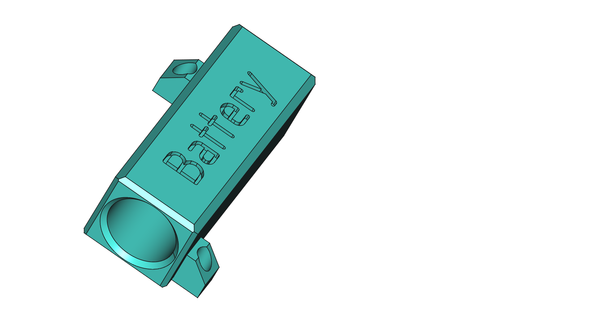
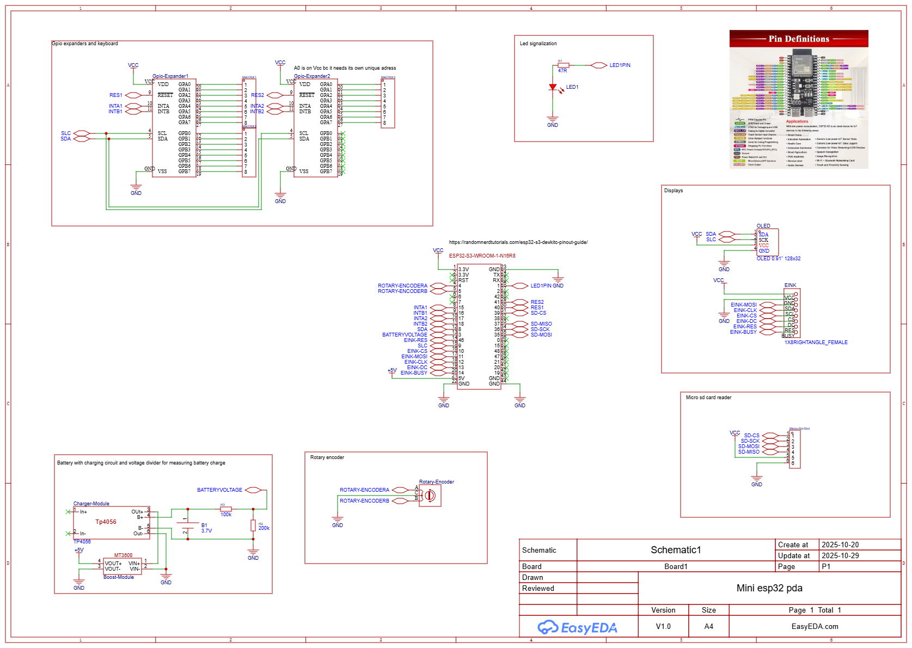

# PROJECT GLYPH.

PROJECT GLYPH. is ESP32-S3 based pocket pda device with eink and oled display and bunch of other cool stuff

## Overview

This project will be my walkthrough about how i built and programmed my pda like device.
It's nothing that big but it's my first more difficult project since im making ui myself.

## Functionality

I want this to be pocketable device, that will be able to mainly write notes. I'm also thinking about adding fuctionality for more apps but thats for other time. It will have micro sd card support for saving notes and other stuff. The keyboard will be custom made from buttons and handled by gpio expanders. The main e ink module will show all the text you are currently working on, but the main oled will be used for typing so you can see change fast. Then it will be sent to the eink, either by user input or by itself. Also it will be battery powered with usb-c charging. Rotary encoder will be ui navigation feature. Vibration motor, piezo buzzer (passive), 2 leds for signalization to user.

## Parts

- Esp32-S3 44pin
- Eink 4.2" display (primary)
- Oled 0.91" I2C display (secondary)
- Custom PCB keyboard
- Sd card slot
- Gpio expanders x2 -> 32 pins
- TP4056 charging module
- 3.7V battery
- Rotary encoder
- Vibration motor with mosfter
- Piezo buzzer (passive)
- LEDs
- Boost converter for boosting battery voltage to 5V
- Bunch of capacitors for voltage smoothing
- Bunch of diodes for ghosting prevention on keyboard
- Bunch of resistors

## Features i need to implement

- [ ] Pda like notetaking (oled is used as writing display and then its sent onto eink display)
- [ ] Saving onto micro sd card
- [ ] Adding support for more programs
- [ ] Keyboard and other navigation buttons functionality
- [ ] Status leds
- [ ] Other features i will think of along the way
- [ ] Rotary encoder ui navigation
- [ ] Vibration motor functionality
## 3d printing

I've created 3d printed design for 18650 battery so that battery wont roll inside. It's a simple slide in and then 2 holes for M3 screws (not threaded).

## Schematic

## Concept visualisation

